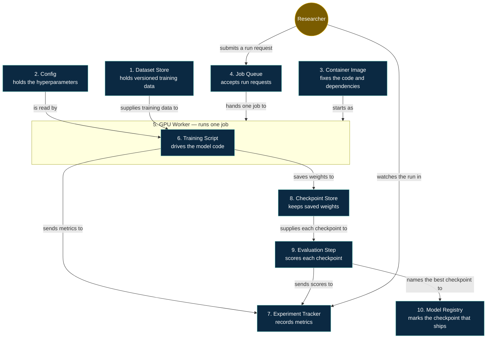

```mermaid
flowchart TD
    classDef part fill:#0b2942,stroke:#7fdbca,color:#fff
    classDef person fill:#7a5c00,stroke:#e0b400,color:#fff

    Researcher(("Researcher")):::person

    Config["2. Config<br/>holds the hyperparameters"]:::part
    Image["3. Container Image<br/>fixes the code and dependencies"]:::part
    Queue["4. Job Queue<br/>accepts run requests"]:::part

    subgraph Worker["5. GPU Worker — runs one job"]
        Script["6. Training Script<br/>drives the model code"]:::part
    end

    Dataset["1. Dataset Store<br/>holds versioned training data"]:::part
    Tracker["7. Experiment Tracker<br/>records metrics"]:::part
    Checkpoints["8. Checkpoint Store<br/>keeps saved weights"]:::part
    Evaluation["9. Evaluation Step<br/>scores each checkpoint"]:::part
    Registry["10. Model Registry<br/>marks the checkpoint that ships"]:::part

    Researcher -- "submits a run request" --> Queue
    Queue -- "hands one job to" --> Worker
    Image -- "starts as" --> Worker
    Config -- "is read by" --> Script
    Dataset -- "supplies training data to" --> Script
    Script -- "sends metrics to" --> Tracker
    Script -- "saves weights to" --> Checkpoints
    Checkpoints -- "supplies each checkpoint to" --> Evaluation
    Evaluation -- "sends scores to" --> Tracker
    Evaluation -- "names the best checkpoint to" --> Registry
    Researcher -- "watches the run in" --> Tracker
```
