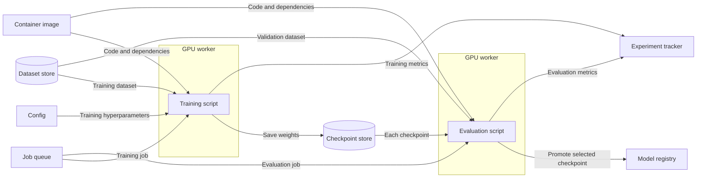

```mermaid
flowchart LR
    Q["Job queue"]
    D[("Dataset store")]
    C["Config"]
    I["Container image"]

    subgraph W["GPU worker"]
        T["Training script"]
    end

    S[("Checkpoint store")]

    subgraph V["GPU worker"]
        E["Evaluation script"]
    end

    R["Model registry"]
    X["Experiment tracker"]

    Q -->|Training job| T
    Q -->|Evaluation job| E
    D -->|Training dataset| T
    C -->|Training hyperparameters| T
    I -->|Code and dependencies| T
    I -->|Code and dependencies| E

    T -->|Save weights| S
    S -->|Each checkpoint| E
    D -->|Validation dataset| E
    E -->|Promote selected checkpoint| R

    T -->|Training metrics| X
    E -->|Evaluation metrics| X
```