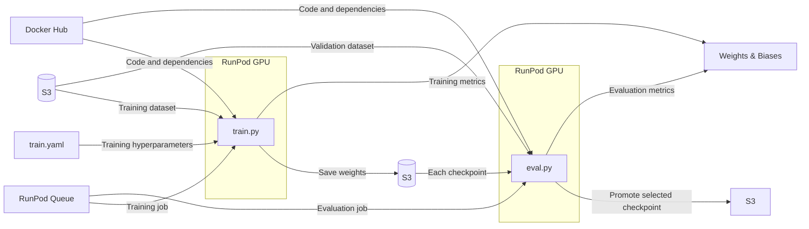

```mermaid
flowchart LR
    Q["RunPod Queue"]
    D[("S3")]
    C["train.yaml"]
    I["Docker Hub"]

    subgraph W["RunPod GPU"]
        T["train.py"]
    end

    S[("S3")]

    subgraph V["RunPod GPU"]
        E["eval.py"]
    end

    R["S3"]
    X["Weights & Biases"]

    Q -->|Training job| T
    Q -->|Evaluation job| E
    D -->|Training dataset| T
    C -->|Training hyperparameters| T
    I -->|Code and dependencies| T
    I -->|Code and dependencies| E

    T -->|Save weights| S
    S -->|Each checkpoint| E
    D -->|Validation dataset| E
    E -->|Promote selected checkpoint| R

    T -->|Training metrics| X
    E -->|Evaluation metrics| X
```